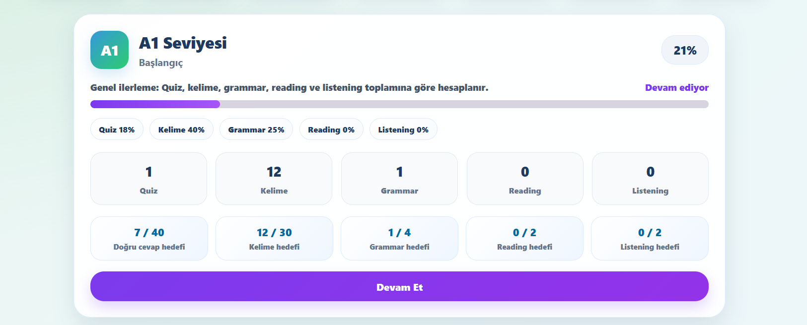

# İlerleme Takip Sistemi

LearnEng uygulamasında kullanıcıların öğrenme sürecini takip edebilmesi için çoklu veriye dayalı bir ilerleme sistemi geliştirilmiştir.

## Sistemin Amacı

İlerleme takip sisteminin amacı, kullanıcının yalnızca quiz başarısını değil, uygulama içindeki farklı öğrenme aktivitelerini de dikkate alarak daha gerçekçi bir seviye ilerlemesi hesaplamaktır.

İlk aşamada seviye ilerlemesi yalnızca quiz sonuçlarına göre düşünülmüştür. Ancak İngilizce öğrenme süreci yalnızca test çözmekten ibaret olmadığı için sistem geliştirilmiş ve farklı modüllerden gelen veriler ilerleme hesabına dahil edilmiştir.

## Kullanılan Veriler

Seviye ilerlemesi hesaplanırken aşağıdaki veriler dikkate alınır:

- Quiz doğru cevap sayısı
- Öğrenilen kelime sayısı
- Çalışılan grammar konu sayısı
- Tamamlanan Reading Practice sayısı
- Tamamlanan Listening Practice sayısı

Bu veriler sayesinde kullanıcıların uygulamadaki genel öğrenme davranışları daha kapsamlı şekilde değerlendirilir.

## İlerleme Hesaplama Mantığı

Genel seviye ilerlemesi beş farklı öğrenme alanının ağırlıklı ortalaması ile hesaplanır.

Kullanılan ağırlıklar şu şekildedir:

- Quiz başarısı: %35
- Öğrenilen kelime: %25
- Grammar çalışması: %20
- Reading Practice: %10
- Listening Practice: %10

Bu yapı sayesinde kullanıcı sadece quiz çözerek değil, farklı modüllerde çalışma yaparak da seviyesinde ilerleyebilir.

## Hedef Değerler

Her seviye için belirlenen hedefler şunlardır:

- Quiz hedefi: 40 doğru cevap
- Kelime hedefi: 30 öğrenilen kelime
- Grammar hedefi: 4 konu
- Reading hedefi: 2 etkinlik
- Listening hedefi: 2 etkinlik

Bu hedefler tamamlandıkça kullanıcının genel seviye yüzdesi artar.

## Örnek Hesaplama

Örneğin bir kullanıcının A1 seviyesinde şu değerlere sahip olduğunu düşünelim:

- Quiz ilerlemesi: %50
- Kelime ilerlemesi: %60
- Grammar ilerlemesi: %25
- Reading ilerlemesi: %50
- Listening ilerlemesi: %50

Genel ilerleme şu şekilde hesaplanır:

(%50 x 0.35) + (%60 x 0.25) + (%25 x 0.20) + (%50 x 0.10) + (%50 x 0.10)

Bu hesaplama sonucunda kullanıcının A1 seviyesi için genel ilerleme yüzdesi elde edilir.

## İlerleme Sayfası

İlerleme sayfasında kullanıcı aşağıdaki bilgileri görebilir:

- Toplam çözülen quiz sayısı
- Toplam doğru cevap sayısı
- Öğrenilen kelime sayısı
- Grammar çalışma sayısı
- Reading çalışma sayısı
- Listening çalışma sayısı
- Tamamlanan seviye sayısı
- Seviye bazlı ilerleme yüzdesi

Ayrıca her seviye için quiz, kelime, grammar, reading ve listening ilerleme yüzdeleri ayrı ayrı gösterilir.

## Profil Sayfasındaki Kullanımı

Profil sayfasında kullanıcının genel istatistikleri gösterilir. Öğrenilen kelime sayısı, tamamlanan seviye sayısı, quiz sayısı ve başarı bilgileri profil ekranında özetlenir.

Tamamlanan seviye sayısı da yeni ilerleme sistemine göre hesaplanır. Yani bir seviyenin tamamlanması yalnızca quiz sonucuna değil, kullanıcının genel öğrenme aktivitelerine bağlıdır.

## İlerleme Ekranı Görünümü

Aşağıda kullanıcının öğrenme ilerlemesini takip ettiği ekran gösterilmiştir.

## Sistemin Önemi

Bu sistem, kullanıcının öğrenme sürecini daha dengeli şekilde değerlendirir. Çünkü İngilizce öğrenimi yalnızca test çözmekten ibaret değildir. Kelime, dil bilgisi, okuma ve dinleme çalışmaları da öğrenme sürecinin önemli parçalarıdır.

Bu nedenle LearnEng uygulamasında ilerleme sistemi tüm bu aktiviteleri birlikte dikkate alacak şekilde geliştirilmiştir.
