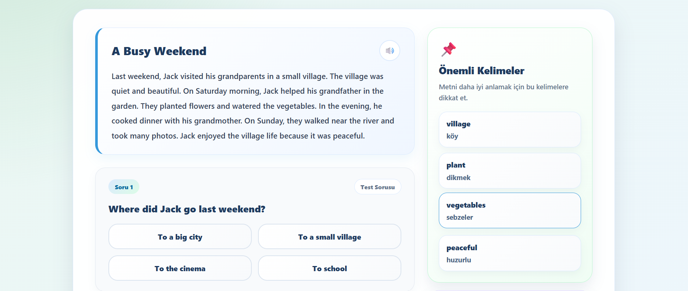
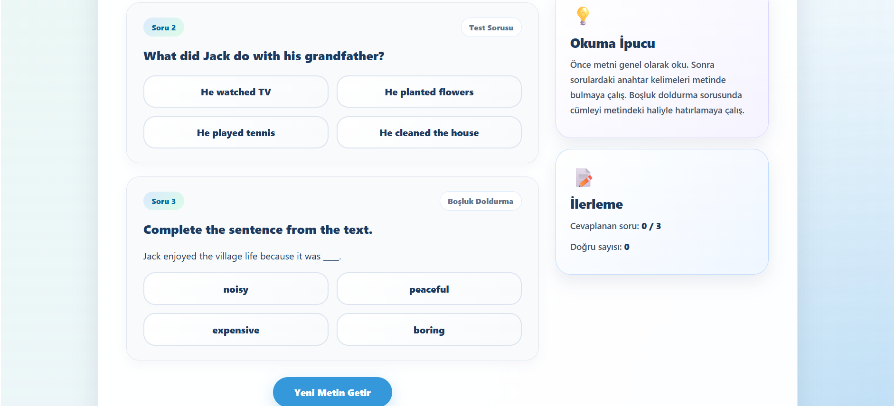

# Reading Practice

Reading Practice modülü, kullanıcının İngilizce okuduğunu anlama becerisini geliştirmek amacıyla hazırlanmıştır.

## Modülün Amacı

Bu modülün amacı, kullanıcının seviyesine uygun kısa İngilizce metinler okuyarak metinle ilgili soruları cevaplamasını sağlamaktır.

Kullanıcı bu sayede hem kelime bilgisini hem de okuduğunu anlama becerisini geliştirebilir.

## İçerik Yapısı

Reading Practice içerikleri seviyeye göre hazırlanmıştır. Her içerikte aşağıdaki bilgiler bulunur:

- Seviye
- Başlık
- Okuma metni
- Anahtar kelimeler
- Metne bağlı sorular
- Doğru cevaplar
- Açıklamalar

## Kullanım Akışı

Kullanıcı Reading Practice modülüne girdiğinde seviyesine uygun bir metin gösterilir. Kullanıcı metni okur ve ardından metinle ilgili soruları cevaplar.

Cevaplardan sonra doğru ve yanlış durumları gösterilir. Kullanıcı böylece metni ne kadar anladığını görebilir.

## Seslendirme Desteği

Reading Practice içinde metin veya cümleler sesli olarak dinlenebilir. Bu özellik, kullanıcının okuma becerisinin yanında telaffuz farkındalığını da geliştirmeyi amaçlar.

## Sonuç Kaydetme

Kullanıcı reading sorularını tamamladığında sonuç `reading_results` tablosuna kaydedilir.

Kaydedilen bilgiler:

- Kullanıcı ID
- Seviye
- Reading ID
- Doğru cevap sayısı
- Toplam soru sayısı
- Oluşturulma tarihi

## İlerleme Sistemindeki Rolü

Reading Practice tamamlanma sayısı, kullanıcının seviye ilerlemesine dahil edilir. Böylece kullanıcı yalnızca quiz çözerek değil, okuma çalışmaları yaparak da seviyesinde ilerleme sağlayabilir.

## Kullanıcıya Katkısı

Reading Practice modülü, kullanıcının İngilizce metinleri anlama becerisini geliştirmeye yardımcı olur. Ayrıca sorular sayesinde kullanıcının metni dikkatli okuyup okumadığı ölçülür.
## Reading Practice Ekranı Görünümleri

Aşağıda LearnEng uygulamasında yer alan Reading Practice modülüne ait örnek ekran görünümleri verilmiştir.

